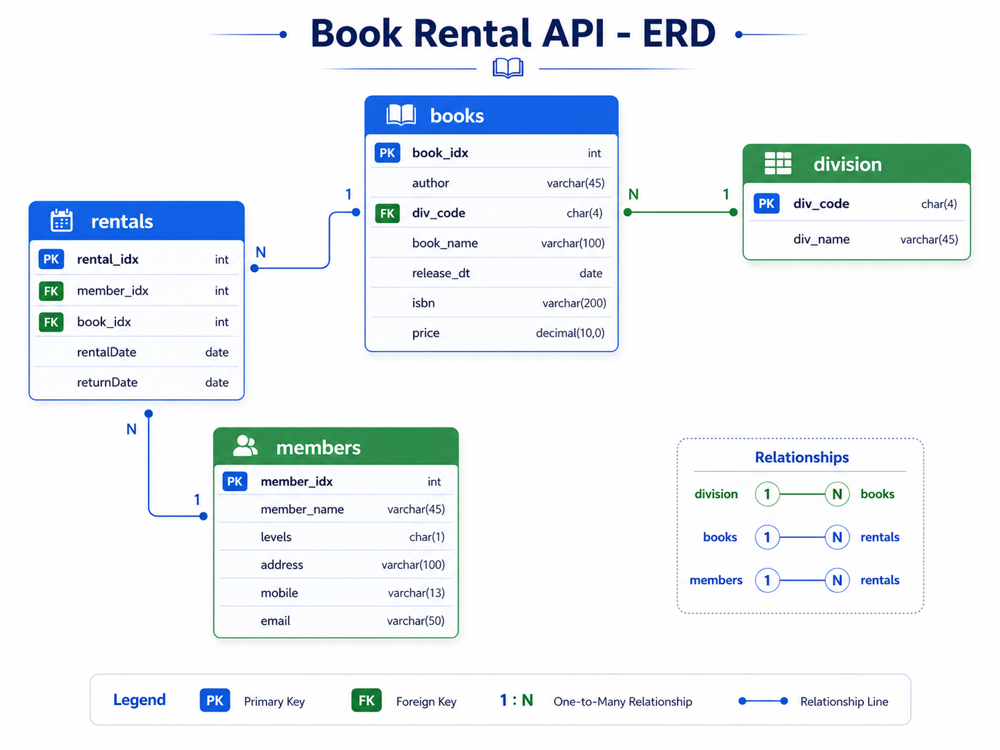
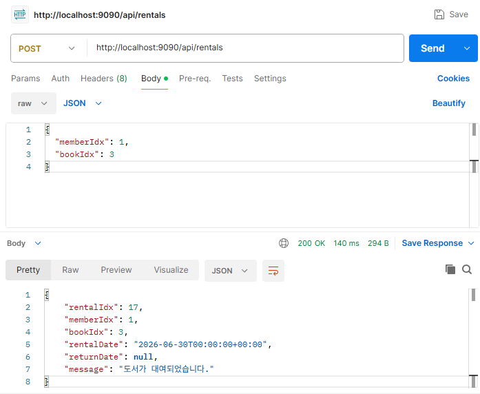
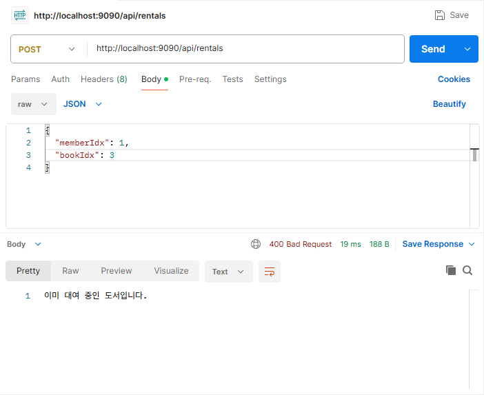
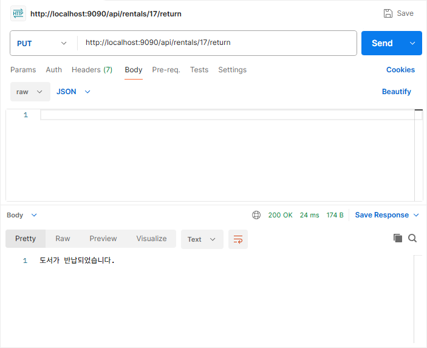
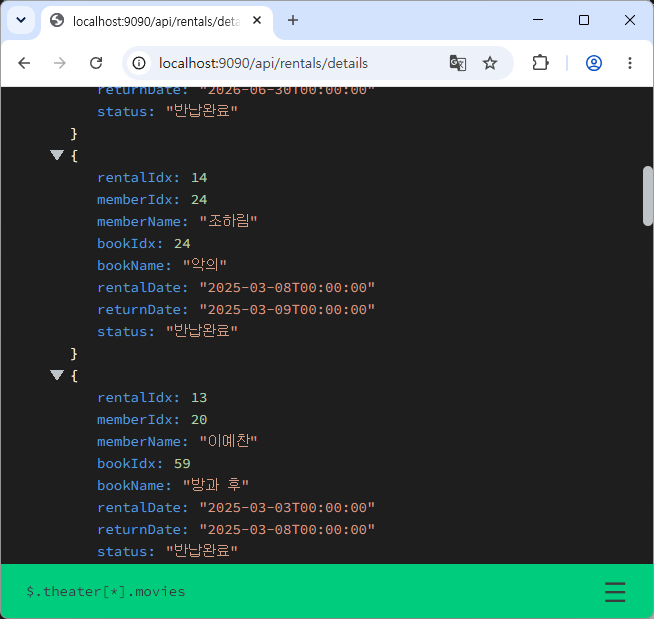
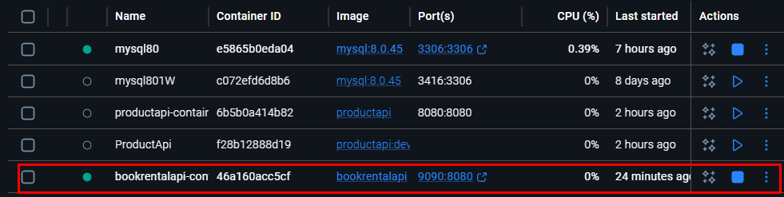

# Book Rental API

ASP.NET Core Web API와 MySQL을 활용한 도서 대여 관리 REST API 프로젝트입니다.

회원, 도서, 도서 분류 정보를 관리하고, 도서 대여 및 반납 처리를 수행할 수 있습니다.  
단순 CRUD 기능뿐만 아니라 대여 중복 방지, 대여 가능한 도서 조회, 회원별/도서별 대여 이력 조회, 상세 응답 데이터 제공 기능을 구현했습니다.

<br>

## 사용 기술

- C#
- ASP.NET Core Web API
- MySQL
- MySqlConnector
- Postman
- Docker

<br>

## 주요 기능

- 도서 분류 CRUD
- 도서 CRUD
- 회원 CRUD
- 도서 대여 처리
- 도서 반납 처리
- 현재 대여 중인 도서 조회
- 대여 가능한 도서 조회
- 회원별 대여 이력 조회
- 도서별 대여 이력 조회
- 회원명, 도서명이 포함된 상세 대여 이력 조회
- 이미 대여 중인 도서의 중복 대여 방지
- Docker 컨테이너 기반 실행 지원

<br>

## ERD



<br>

## 프로젝트 구조

```text
BookRentalApi
 ┣ Controllers
 ┃ ┣ BooksController.cs
 ┃ ┣ DivisionsController.cs
 ┃ ┣ MembersController.cs
 ┃ ┗ RentalsController.cs
 ┣ Models
 ┃ ┣ Book.cs
 ┃ ┣ BookRequest.cs
 ┃ ┣ Division.cs
 ┃ ┣ Member.cs
 ┃ ┣ MemberRequest.cs
 ┃ ┣ Rental.cs
 ┃ ┣ RentalRequest.cs
 ┃ ┗ RentalDetail.cs
 ┣ appsettings.json
 ┣ Program.cs
 ┗ Dockerfile
```

<br>

## API 목록

### 도서 분류 API

| Method | URL | 설명 |
|---|---|---|
| GET | `/api/divisions` | 도서 분류 목록 조회 |
| GET | `/api/divisions/{divCode}` | 도서 분류 단건 조회 |
| POST | `/api/divisions` | 도서 분류 등록 |
| PUT | `/api/divisions/{divCode}` | 도서 분류 수정 |
| DELETE | `/api/divisions/{divCode}` | 도서 분류 삭제 |

<br>

### 도서 API

| Method | URL | 설명 |
|---|---|---|
| GET | `/api/books` | 도서 목록 조회 |
| GET | `/api/books/{id}` | 도서 단건 조회 |
| GET | `/api/books/available` | 대여 가능한 도서 목록 조회 |
| POST | `/api/books` | 도서 등록 |
| PUT | `/api/books/{id}` | 도서 수정 |
| DELETE | `/api/books/{id}` | 도서 삭제 |

<br>

### 회원 API

| Method | URL | 설명 |
|---|---|---|
| GET | `/api/members` | 회원 목록 조회 |
| GET | `/api/members/{id}` | 회원 단건 조회 |
| POST | `/api/members` | 회원 등록 |
| PUT | `/api/members/{id}` | 회원 수정 |
| DELETE | `/api/members/{id}` | 회원 삭제 |

<br>

### 대여 API

| Method | URL | 설명 |
|---|---|---|
| GET | `/api/rentals` | 대여 이력 목록 조회 |
| GET | `/api/rentals/{id}` | 대여 이력 단건 조회 |
| GET | `/api/rentals/active` | 현재 대여 중인 목록 조회 |
| GET | `/api/rentals/details` | 대여 이력 상세 목록 조회 |
| GET | `/api/rentals/active/details` | 현재 대여 중인 상세 목록 조회 |
| GET | `/api/rentals/member/{memberId}` | 회원별 대여 이력 조회 |
| GET | `/api/rentals/member/{memberId}/details` | 회원별 상세 대여 이력 조회 |
| GET | `/api/rentals/book/{bookId}` | 도서별 대여 이력 조회 |
| GET | `/api/rentals/book/{bookId}/details` | 도서별 상세 대여 이력 조회 |
| POST | `/api/rentals` | 도서 대여 |
| PUT | `/api/rentals/{id}/return` | 도서 반납 |

<br>

## 주요 기능 흐름

### 도서 대여 처리

도서 대여 시 단순히 대여 정보를 등록하는 것이 아니라, 회원과 도서의 존재 여부 및 현재 대여 상태를 확인합니다.

```text
1. 회원 존재 여부 확인
2. 도서 존재 여부 확인
3. 해당 도서가 현재 대여 중인지 확인
4. 대여 가능하면 rentals 테이블에 등록
5. 이미 대여 중이면 대여 실패 응답 반환
```

요청 예시:

```http
POST /api/rentals
```

```json
{
  "memberIdx": 1,
  "bookIdx": 3
}
```

응답 예시:

```json
{
  "rentalIdx": 1,
  "memberIdx": 1,
  "bookIdx": 3,
  "rentalDate": "2026-06-30T00:00:00",
  "returnDate": null,
  "message": "도서가 대여되었습니다."
}
```

<br>

### 중복 대여 방지

반납되지 않은 도서는 다시 대여할 수 없도록 처리했습니다.

```sql
SELECT COUNT(*)
FROM rentals
WHERE book_idx = @BookIdx
  AND returnDate IS NULL;
```

이미 대여 중인 경우 응답 예시:

```json
{
  "message": "이미 대여 중인 도서입니다."
}
```

<br>

### 도서 반납 처리

반납 시 `returnDate`를 현재 날짜로 수정합니다.

```http
PUT /api/rentals/{id}/return
```

```text
1. 대여 번호 확인
2. 아직 반납되지 않은 대여 내역인지 확인
3. returnDate를 현재 날짜로 수정
```

<br>

### 대여 가능한 도서 조회

현재 대여 중인 도서를 제외하고 대여 가능한 도서만 조회합니다.

```http
GET /api/books/available
```

<br>

### 상세 대여 이력 조회

대여 이력 조회 시 `member_idx`, `book_idx`만 보여주는 것이 아니라,  
`members`, `books` 테이블과 JOIN하여 회원명과 도서명을 함께 제공합니다.

```http
GET /api/rentals/details
```

응답 예시:

```json
[
  {
    "rentalIdx": 1,
    "memberIdx": 1,
    "memberName": "김민수",
    "bookIdx": 3,
    "bookName": "ASP.NET Core Web API 입문",
    "rentalDate": "2026-06-30T00:00:00",
    "returnDate": null,
    "status": "대여중"
  }
]
```

<br>

## Postman 테스트

본 프로젝트는 Postman을 사용하여 REST API 동작을 테스트했습니다.

### 테스트 흐름

```text
1. GET /api/books/available
   - 대여 가능한 도서 목록 확인

2. POST /api/rentals
   - 도서 대여 처리

3. GET /api/rentals/active/details
   - 현재 대여 중인 도서 확인

4. GET /api/books/available
   - 대여한 도서가 목록에서 제외되는지 확인

5. POST /api/rentals
   - 같은 도서를 다시 대여 시도

6. 중복 대여 실패 메시지 확인

7. PUT /api/rentals/{id}/return
   - 도서 반납 처리

8. GET /api/books/available
   - 반납한 도서가 다시 목록에 표시되는지 확인
```

<br>

## Docker 실행 방법

### Docker 이미지 빌드

Dockerfile이 있는 위치에서 아래 명령어를 실행합니다.

```powershell
docker build -t bookrentalapi .
```

<br>

### Docker 컨테이너 실행

컨테이너 내부에서는 8080 포트를 사용하고, 로컬 PC에서는 9090 포트로 접속하도록 실행합니다.

```powershell
docker run -d --name bookrentalapi-container -p 9090:8080 bookrentalapi
```

포트 매핑 의미:

```text
localhost:9090 → container:8080
```

<br>

### Docker 실행 확인

```powershell
docker ps
```

로그 확인:

```powershell
docker logs bookrentalapi-container
```

컨테이너 중지:

```powershell
docker stop bookrentalapi-container
```

컨테이너 삭제:

```powershell
docker rm bookrentalapi-container
```

<br>

### Docker 실행 후 API 접속

```text
http://localhost:9090/api/books
http://localhost:9090/api/members
http://localhost:9090/api/rentals/details
```

<br>

## Docker 실행 시 주의사항

Docker 컨테이너 내부에서 `localhost`는 사용자의 PC가 아니라 컨테이너 자기 자신을 의미합니다.  
따라서 MySQL이 로컬 PC에서 실행 중이라면 `appsettings.json`의 DB 서버 주소를 다음과 같이 설정해야 합니다.

```json
{
  "ConnectionStrings": {
    "BookRentalDbConnection": "Server=host.docker.internal;Port=3306;Database=bookrentalshop;Uid=root;Pwd=비밀번호;"
  }
}
```

또는 PC의 내부 IP 주소를 사용할 수 있습니다.

```json
{
  "ConnectionStrings": {
    "BookRentalDbConnection": "Server=192.168.0.10;Port=3306;Database=bookrentalshop;Uid=root;Pwd=비밀번호;"
  }
}
```

<br>

## 실행 화면

### Postman 도서 대여 성공



### Postman 중복 대여 실패



### Postman 도서 반납 성공



### Postman 대여 상세 조회



### Docker 컨테이너 실행 화면



<br>

## 학습 내용

- ASP.NET Core Web API 프로젝트 구조 이해
- Controller 기반 REST API 구현
- MySqlConnector를 활용한 MySQL 연동
- 비동기 DB 처리 방식 이해
- REST API의 GET, POST, PUT, DELETE 메서드 구현
- 테이블 관계를 활용한 대여/반납 비즈니스 로직 구현
- JOIN을 활용한 상세 응답 데이터 구성
- Dockerfile을 활용한 API 컨테이너 이미지 생성
- Docker 포트 매핑 방식 이해