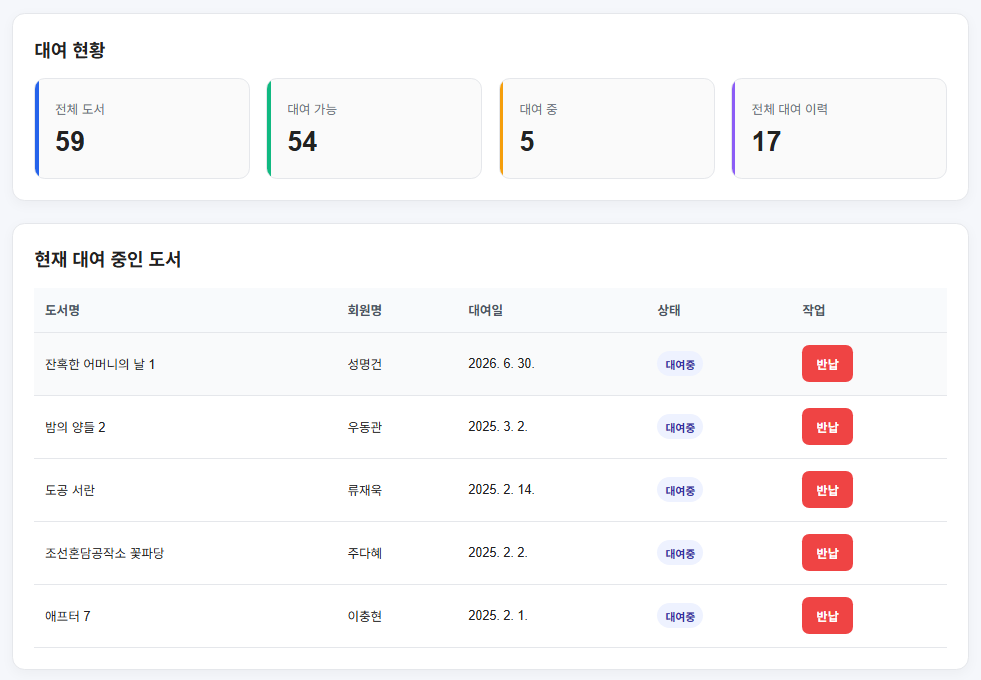
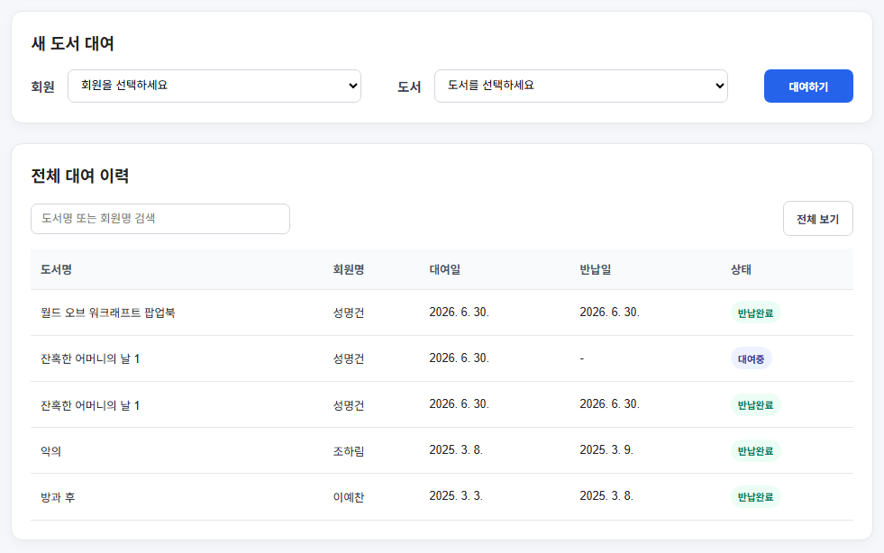
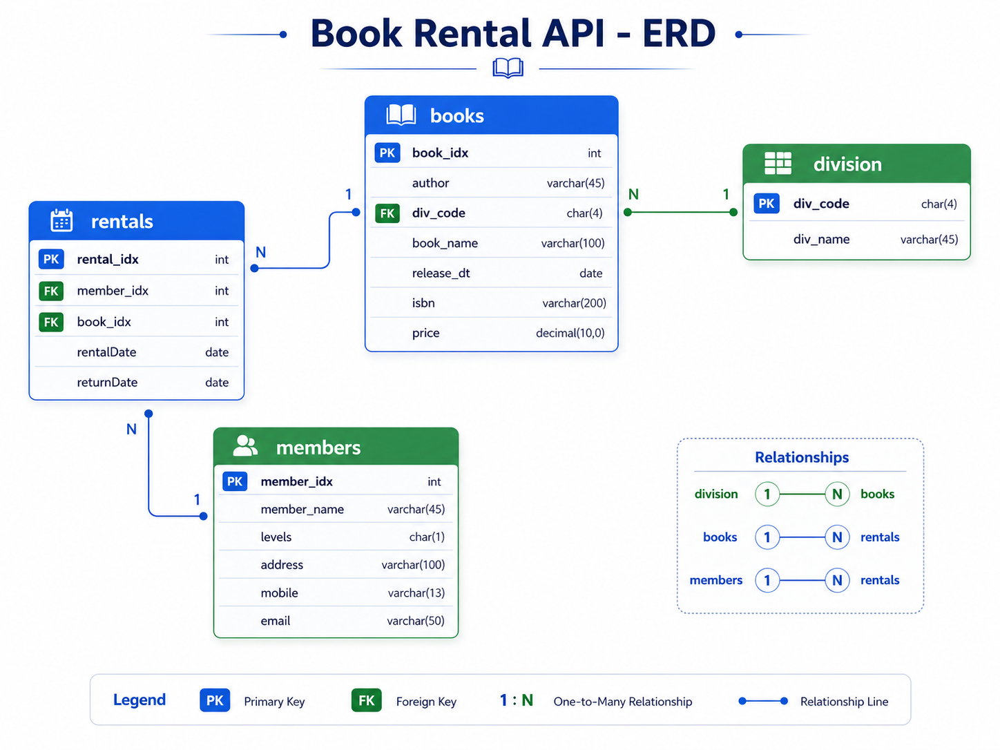
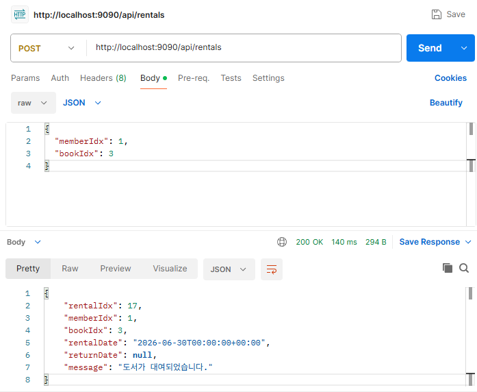
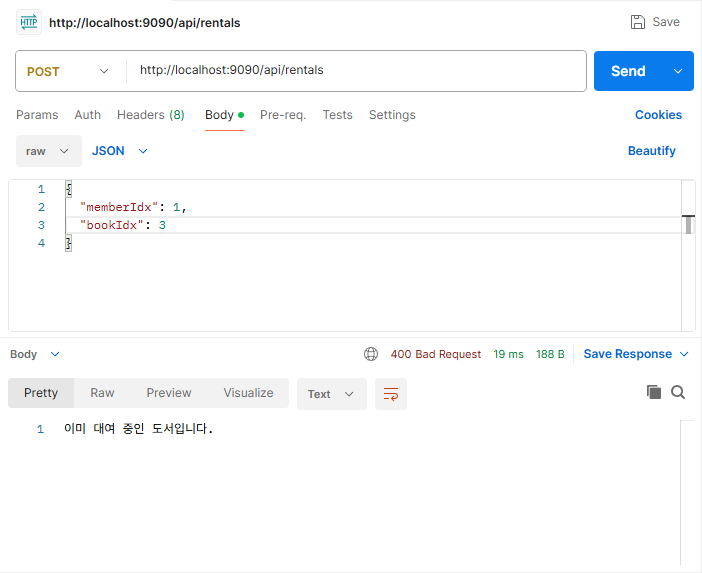
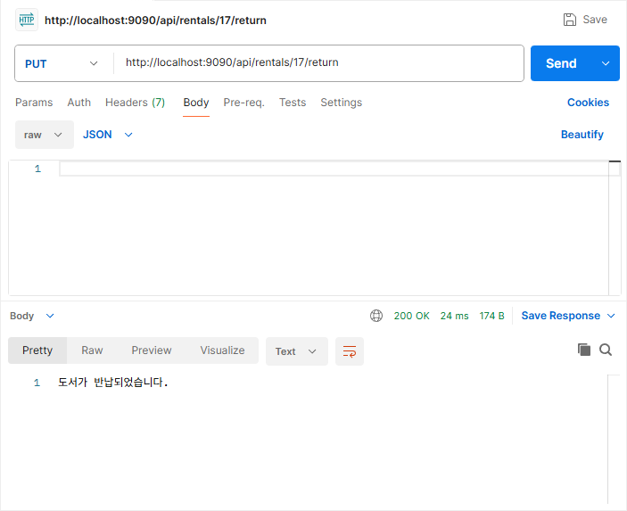
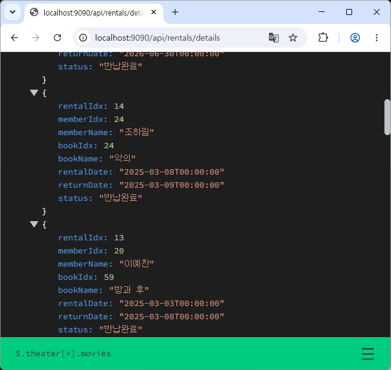
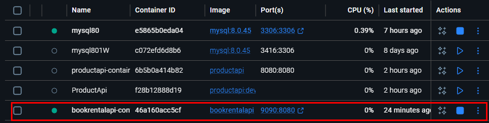

# ASP.NET Core 기반 도서 대여 관리 시스템

> ASP.NET Core Web API와 MySQL을 기반으로 도서 대여·반납 업무를 처리하고, 웹 관리 화면에서 대여 현황과 이력을 확인할 수 있도록 구현한 프로젝트

## 프로젝트 개요

| 구분 | 내용 |
| --- | --- |
| 구현 범위 | 도서·회원·분류 관리, 도서 대여·반납, 대여 현황·이력 조회 |
| Backend | C#, ASP.NET Core Web API |
| Frontend | HTML, CSS, JavaScript, Fetch API |
| Database | MySQL |
| DB 연동 | MySqlConnector |
| Test / Tool | Postman, Docker, Visual Studio |

## 프로젝트 소개

도서 대여 업무의 기본 흐름을 웹 환경에서 처리할 수 있도록  
ASP.NET Core Web API와 MySQL을 기반으로 백엔드 API를 구현하고, HTML/CSS/JavaScript 기반 관리 화면을 연동했습니다.

회원과 도서 정보를 기준으로 대여 및 반납을 처리하고, 현재 대여 중인 도서와 전체 대여 이력을 조회할 수 있도록 구성했습니다.

단순 CRUD뿐만 아니라 대여 중인 도서의 중복 대여 방지, 대여 가능한 도서 조회, 회원별·도서별 이력 조회, JOIN을 이용한 상세 대여 이력 조회 기능을 구현했습니다.

웹 관리 화면에서는 대여 현황을 요약해서 확인할 수 있으며, 회원과 도서를 선택해 대여를 처리하고 현재 대여 중인 도서를 반납할 수 있습니다.

## 주요 기능

### 1. 대여 현황 조회

웹 관리 화면에서 다음 항목을 요약해 표시합니다.

```text
전체 도서 수
대여 가능 도서 수
현재 대여 중인 도서 수
전체 대여 이력 수
```

대여 또는 반납 처리 후 관련 API를 다시 호출하여 화면의 현황 정보를 자동으로 갱신합니다.

### 2. 도서 대여

회원과 대여 가능한 도서를 선택해 대여를 처리합니다.

대여 요청 시 다음 내용을 확인합니다.

```text
1. 회원 존재 여부 확인
2. 도서 존재 여부 확인
3. 현재 대여 중인 도서인지 확인
4. 대여 가능한 경우 대여 이력 등록
5. 이미 대여 중인 경우 요청 차단
```

### 3. 중복 대여 방지

반납되지 않은 도서는 다시 대여할 수 없도록 처리했습니다.

```sql
SELECT COUNT(*)
FROM rentals
WHERE book_idx = @BookIdx
  AND returnDate IS NULL;
```

이미 대여 중인 도서인 경우 대여 요청을 처리하지 않습니다.

### 4. 도서 반납

현재 대여 중인 도서에 대해 반납을 처리합니다.

```http
PUT /api/rentals/{id}/return
```

반납되지 않은 대여 이력의 `returnDate`를 현재 날짜로 변경하고, 반납한 도서는 다시 대여 가능한 도서 목록에 포함됩니다.

### 5. 현재 대여 중인 도서 조회

현재 반납되지 않은 대여 건만 조회하여 웹 화면에 표시합니다.

```text
도서명
회원명
대여일
상태
반납 기능
```

### 6. 상세 대여 이력 조회

대여 이력의 회원 번호와 도서 번호만 반환하지 않고,  
`members`, `books` 테이블을 JOIN하여 회원명과 도서명을 함께 조회하도록 구성했습니다.

```http
GET /api/rentals/details
```

응답 예시:

```json
[
  {
    "rentalIdx": 1,
    "memberIdx": 1,
    "memberName": "김민수",
    "bookIdx": 3,
    "bookName": "ASP.NET Core Web API 입문",
    "rentalDate": "2026-06-30T00:00:00",
    "returnDate": null,
    "status": "대여중"
  }
]
```

### 7. 대여 이력 검색

전체 대여 이력에서 다음 항목을 기준으로 검색할 수 있습니다.

```text
도서명
회원명
```

기본 화면에서는 최근 5건을 표시하고, `전체 보기` 버튼을 통해 전체 이력을 확인할 수 있도록 구성했습니다.

## 시스템 구조

```text
사용자
  │
  ▼
HTML / CSS / JavaScript
  │
  │ Fetch API
  ▼
ASP.NET Core Web API
  │
  │ MySqlConnector / SQL
  ▼
MySQL
```

웹 관리 화면에서 Fetch API를 이용해 ASP.NET Core Web API를 호출하고,  
Web API에서 MySqlConnector를 이용해 MySQL 데이터를 조회·수정하도록 구성했습니다.

## 실행 화면

### 대여 현황 및 반납 관리



대여 현황 카드와 현재 대여 중인 도서 목록을 통해 전체 도서 수, 대여 가능 수, 대여 중인 도서 수와 상태를 확인할 수 있습니다.

현재 대여 중인 도서는 목록에서 바로 반납 처리할 수 있습니다.

### 도서 대여 및 이력 조회



회원과 대여 가능한 도서를 선택해 새로운 대여를 처리하고,  
전체 대여 이력에서 도서명 또는 회원명을 기준으로 검색할 수 있습니다.

## ERD



도서 분류, 도서, 회원, 대여 이력 간의 관계를 기준으로 데이터베이스를 구성했습니다.

## 데이터 흐름

### 도서 대여

1. 웹 화면에서 회원과 도서를 선택합니다.
2. JavaScript에서 `POST /api/rentals`를 호출합니다.
3. Web API에서 회원 존재 여부를 확인합니다.
4. 도서 존재 여부를 확인합니다.
5. 현재 해당 도서가 대여 중인지 확인합니다.
6. 대여 가능한 경우 `rentals` 테이블에 대여 이력을 등록합니다.
7. 프론트엔드에서 대여 현황과 이력 데이터를 다시 조회합니다.
8. 페이지 새로고침 없이 화면을 갱신합니다.

### 도서 반납

1. 현재 대여 목록에서 `반납` 버튼을 선택합니다.
2. JavaScript에서 `PUT /api/rentals/{id}/return`을 호출합니다.
3. Web API에서 반납되지 않은 대여 이력인지 확인합니다.
4. `returnDate`를 현재 날짜로 변경합니다.
5. 해당 도서를 대여 가능한 도서 목록에 다시 포함합니다.
6. 웹 화면의 대여 현황과 이력을 다시 조회합니다.

## 주요 구현 내용

### 대여 가능 도서 조회

현재 대여 중인 도서를 제외하고 대여 가능한 도서만 조회합니다.

```http
GET /api/books/available
```

대여 화면의 도서 선택 목록에는 이 API의 조회 결과만 표시합니다.

### 대여·반납 후 화면 자동 갱신

대여 또는 반납 처리 후 다음 데이터를 다시 조회합니다.

```text
대여 현황
현재 대여 목록
대여 가능한 도서 목록
전체 대여 이력
```

페이지 전체를 다시 불러오지 않고 변경된 데이터만 반영하도록 구성했습니다.

### JavaScript 공통 로직 정리

반복되던 API 호출과 대여 이력 검색 로직을 공통 함수로 분리했습니다.

```text
fetchJson()
refreshRentalData()
filterRentalHistory()
```

API 응답 확인, 대여 관련 데이터 갱신, 검색 기능을 각각 분리하여 중복 코드를 줄였습니다.

### 대여 이력 상태 표시

대여 이력의 `returnDate` 여부를 기준으로 상태를 구분합니다.

```text
returnDate IS NULL
→ 대여중

returnDate IS NOT NULL
→ 반납완료
```

웹 화면에서는 상태에 따라 서로 다른 UI 스타일을 적용했습니다.

## 기술 스택

| 구분 | 기술 | 활용 내용 |
| --- | --- | --- |
| Language | C# | Web API 및 업무 로직 구현 |
| Backend | ASP.NET Core Web API | REST API 구현 |
| Frontend | HTML / CSS / JavaScript | 웹 관리 화면 구현 |
| API Client | Fetch API | 프론트엔드·백엔드 통신 |
| Database | MySQL | 도서·회원·대여 데이터 관리 |
| DB Connector | MySqlConnector | ASP.NET Core와 MySQL 연동 |
| Test | Postman | REST API 동작 검증 |
| Container | Docker | API 컨테이너 실행 |
| Tool | Visual Studio | 프로젝트 개발 |

## 프로젝트 구조

```text
book-rental-api/
├─ BookRentalApi/
│  ├─ Controllers/
│  │  ├─ BooksController.cs
│  │  ├─ DivisionsController.cs
│  │  ├─ MembersController.cs
│  │  └─ RentalsController.cs
│  ├─ Models/
│  │  ├─ Book.cs
│  │  ├─ BookRequest.cs
│  │  ├─ Division.cs
│  │  ├─ Member.cs
│  │  ├─ MemberRequest.cs
│  │  ├─ Rental.cs
│  │  ├─ RentalDetail.cs
│  │  └─ RentalRequest.cs
│  ├─ wwwroot/
│  │  ├─ css/
│  │  │  └─ style.css
│  │  ├─ js/
│  │  │  └─ app.js
│  │  └─ index.html
│  ├─ Properties/
│  │  └─ launchSettings.json
│  ├─ Program.cs
│  ├─ appsettings.json
│  └─ Dockerfile
├─ images/
│  ├─ book-rental-dashboard.png
│  ├─ book-rental-history.png
│  ├─ erd.png
│  ├─ rent-book-success.png
│  ├─ rent-book-duplicate-fail.png
│  ├─ return-book-success.png
│  ├─ rental-details.png
│  └─ docker-container.png
├─ docs/
│  └─ README-detail.md
└─ README.md
```

## 주요 소스

| 경로 | 역할 |
| --- | --- |
| `BookRentalApi/Controllers/BooksController.cs` | 도서 CRUD 및 대여 가능 도서 조회 |
| `BookRentalApi/Controllers/MembersController.cs` | 회원 CRUD |
| `BookRentalApi/Controllers/DivisionsController.cs` | 도서 분류 CRUD |
| `BookRentalApi/Controllers/RentalsController.cs` | 대여·반납 및 대여 이력 조회 |
| `BookRentalApi/wwwroot/js/app.js` | API 호출, 화면 갱신, 검색, 대여·반납 처리 |
| `BookRentalApi/wwwroot/css/style.css` | 웹 관리 화면 스타일 |
| `BookRentalApi/wwwroot/index.html` | 웹 관리 화면 구성 |

## 실행 방법

### 1. 프로젝트 실행

Visual Studio에서 다음 프로젝트를 실행합니다.

```text
BookRentalApi
```

HTTP 프로필을 사용하는 경우 기본 실행 주소는 다음과 같습니다.

```text
http://localhost:5192
```

브라우저에서 해당 주소로 접속하면 웹 관리 화면을 확인할 수 있습니다.

### 2. MySQL 연결

`appsettings.json`의 연결 문자열을 현재 MySQL 환경에 맞게 설정합니다.

```json
{
  "ConnectionStrings": {
    "BookRentalDbConnection": "Server=localhost;Port=3306;Database=bookrentalshop;Uid=root;Pwd=비밀번호;"
  }
}
```

### 3. 웹 관리 화면 사용

웹 관리 화면에서 다음 기능을 사용할 수 있습니다.

```text
대여 현황 조회
현재 대여 목록 조회
새 도서 대여
도서 반납
전체 대여 이력 조회
도서명·회원명 검색
최근 5건 / 전체 이력 전환
```

## Postman 테스트

REST API의 대여 업무 흐름을 Postman으로 확인했습니다.

### 도서 대여 성공



### 중복 대여 차단



### 도서 반납 성공



### 상세 대여 이력 조회



## Docker 실행

Docker 이미지 빌드:

```powershell
docker build -t bookrentalapi -f BookRentalApi/Dockerfile BookRentalApi
```

컨테이너 실행:

```powershell
docker run -d --name bookrentalapi-container -p 9090:8080 bookrentalapi
```

포트 매핑:

```text
localhost:9090 → container:8080
```

실행 확인:

```powershell
docker ps
```



## 상세 문서

전체 API 목록과 요청·응답 예시, Postman 테스트 흐름, Docker 설정 등 상세 내용은 별도 문서에서 확인할 수 있습니다.

[상세 구현 문서](./docs/README-detail.md)

## 구현 결과

ASP.NET Core Web API와 MySQL을 기반으로 도서·회원 데이터 관리부터 대여 가능 여부 확인, 대여·반납 처리, 상세 이력 조회까지 하나의 업무 흐름으로 구현했습니다.

또한 HTML/CSS/JavaScript 기반 웹 관리 화면을 연동하여 API 결과를 직접 확인하고, 대여 및 반납 처리 후 관련 데이터를 자동으로 갱신하도록 구성했습니다.

이 프로젝트를 통해 REST API와 관계형 데이터베이스를 연동하고, 백엔드 업무 로직과 웹 화면을 하나의 시스템으로 연결하는 과정을 구현했습니다.
